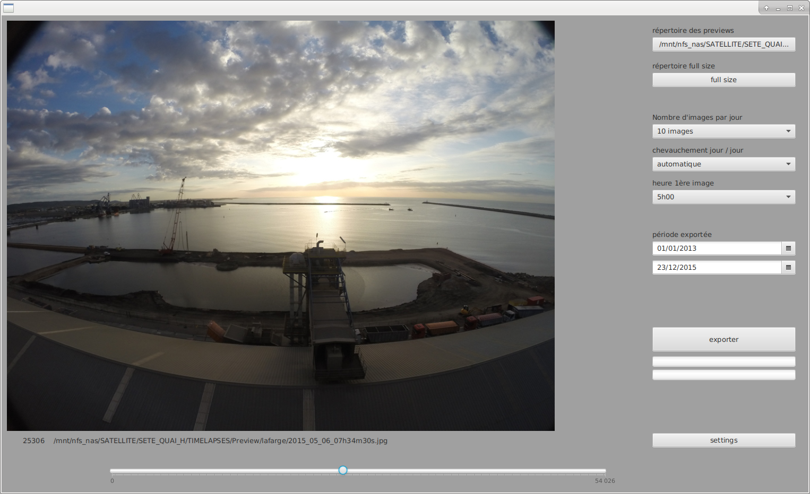

# timeLapseSelect
select ranges of pictures from looooooonnng timelapse using a proxy and export full resolution prores film  (javaFX + ffmpeg)

####permet de construire de nouvelles temporalités :
afin d'exploiter les séries de timelapse très conséquentes (> 100 000 images prises avec un intervalle de 5 minutes sur 2 ans) et de couvrir des évènements sur plusieurs jours sans avoir de successions de jours et de nuits

par exemple : 3 images par jour, sans chevauchement, à partir du lundi 3 août à 5h00, jusqu'au vendredi 29 septembre donnera 
- lundi 3/8 5h00
- lundi 3/8 5h05
- lundi 3/8 5h10
- mardi 4/8 5h15
- mardi 4/8 5h20
- mardi 4/8  5h25
- mercredi 5/8 5h30
...
- lundi 28/9 18h15
- lundi 28/9 18h20
- lundi 28/9 18h25
- mardi 29/9 18h30
- mardi 29/9 18h35
- mardi 29/9 18h40

####interface graphique

